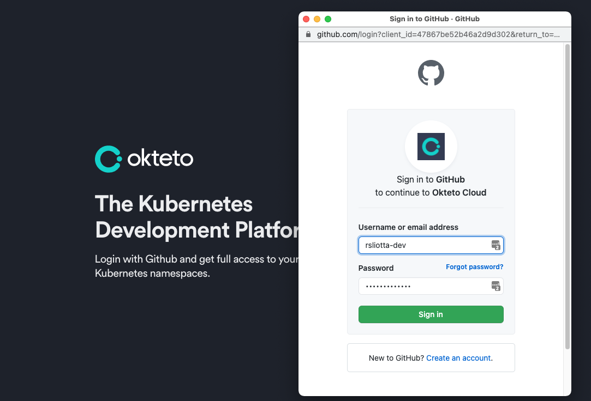
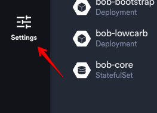
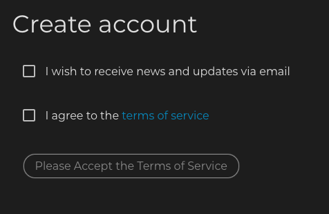
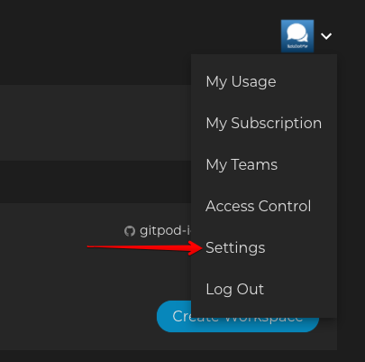

# Getting Started for Developers

## Remarks
One if the coolest things about this project is I wanted to experience how we develop completely in the cloud with modern tools and practices.  That being said, the only tool you require on your local laptop/tablet (yes I said tablet) is the chrome web browser.  Others work as well but I found chrome to be the best.

As a note, you of course will require to have a github account to develop but I will not get into how to do that in this document.

## Cloud Requirements
There are two main cloud SAAS tools required to do the development and the best part is these tools can be used for free.  I have been using them for a bit determined to pay for some subscriptions since you can turn them on or off as required.

The first tool is called OKTETO that is used to actively develop Kubernetes in a very efficient manner and the second is called Gitpod and is a very feature rich cloud based developer IDE.

To get started, do the following:
### Okteto

* Head over to https://okteto.com and click the 'Login' Link at the top right of the page.

* Following that you should get something like a button like 'Login with Github'.  Click the button.  A dialog box should pop up that looks like this:

* Go ahead and accept the license.
* If all goes well, you should now see the Gitpod workspace!
* Click on your settings button by clicking the down arrow next to the profile pic

* One last task.  Get a copy of your API token by clicking this button.

* Okteto is now setup

### Gitpod
* Head over to https://gitpod.io  and click the 'Login' Link at the top right of the page.

* Following that you should get something like a button like 'Login with Github'.  Click the button.  A dialog box should pop up that looks like this:

* Go ahaead and enter you credentials.
* If all goes well, you should now see the Okteto workspace!
* Click on your settings button left like so:

* One last task.  You will need to create two variables to link Gitpod to Okteto
* Click the 'Add Variable' button.
  * You need to create the OKTETO_LOGIN and OKTETO_TOKEN variables using the value you copied from Okteto earlier in the steps.  It should look something like this:

* Gitpod is now setup

### Start Development

* Head over the https://github.com/262life/bob and either fork the project and/or checkout depending on your project rights.
* Hit the "Gitpod" Button.  It start start Gitpod and checkout your workspace.

* You will notice the editor is the widely used VSCode editor.  To test building, just type 'build' in a terminal window.  That's it!

* You can open the Okteto.com page to see the build progress. 
* Once ready, you can type 'kubectl get pods' and you should get a normal pod listing.

